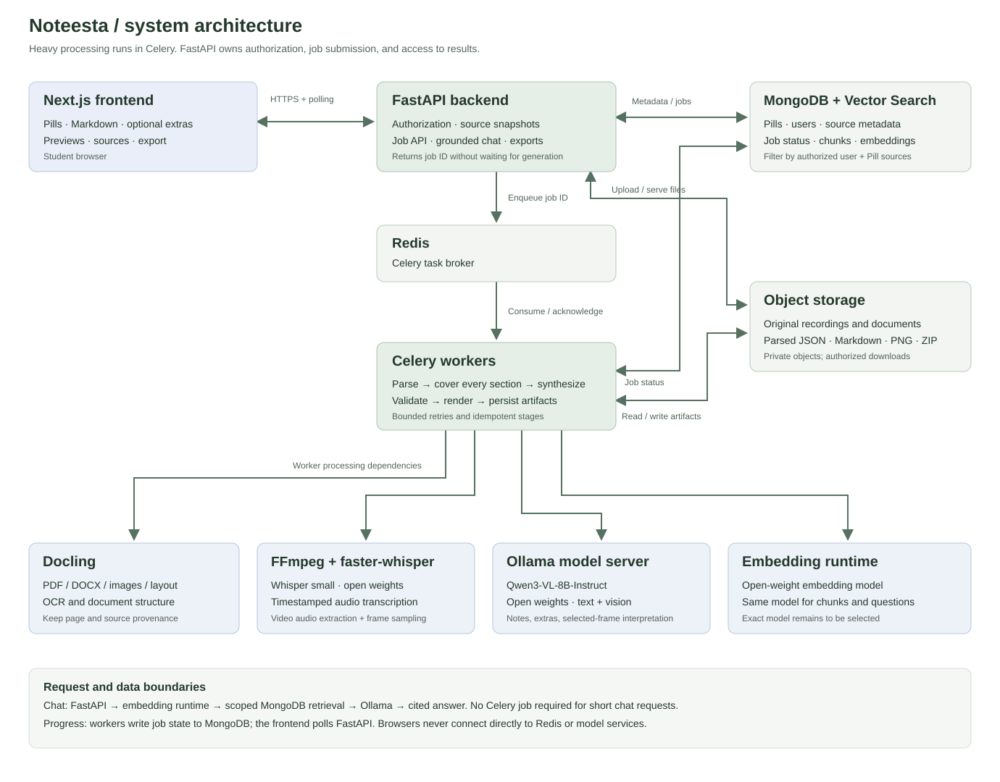

# Noteesta system architecture

[Editable Mermaid source](diagrams/system-architecture.mmd) · [Open full-size diagram](diagrams/system-architecture.svg)

## Responsibilities

| Component | Responsibility |
| --- | --- |
| Next.js | Source selection, Pill workspace, Markdown rendering, accessible previews, optional materials, job progress, export |
| FastAPI | Authenticate and authorize access, validate sources, bind source snapshots to Pills, submit jobs, expose status and artifacts, orchestrate scoped chat |
| Redis | Celery task broker; large files do not go through the queue |
| Celery | Parse, transcribe, process every source section, synthesize notes and selected extras, validate, render diagrams, package exports |
| MongoDB + Vector Search | Pill/source metadata, job state, source chunks and embeddings; scope retrieval to the authorized user and selected sources |
| Object storage | Original files, parsed Docling JSON, generated Markdown, PNG visuals, export ZIP archives |
| Docling | Structured document parsing, layout, tables, OCR, page provenance |
| FFmpeg + faster-whisper | Extract audio and sample video frames; transcribe using **Whisper small**, retaining timestamps |
| Ollama + Qwen3-VL-8B-Instruct | Local open-weight text/vision inference for synthesis, selected visual interpretation, optional materials and grounded chat |
| Embedding runtime | Open-weight text embeddings for chunks and queries; exact model and dimensions remain to be selected |

## Processing sequence

1. FastAPI validates and stores uploads or resolves accessible YouTube captions/media. Previously stored files are reusable only after an ownership check.
2. Save an immutable list of selected source IDs and versions for the job. Queue IDs and settings, not file contents.
3. A Celery worker parses/transcribes all selected sources and retains source/page/timestamp references. Visual video content needs sampled frames; the audio transcript alone does not cover slides.
4. Process all source sections in bounded batches, then synthesize the complete notes and independently selected optional outputs. Validate source references and structured outputs. Render source-supported chart/diagram specifications with controlled rendering code.
5. Separately embed chunks for targeted lookups and chat. The synthesis coverage step does not depend on the top vector-search results.
6. Persist Markdown and visual assets in object storage and artifact references/status in MongoDB. The browser polls FastAPI for progress and retrieves authorized results.
7. Export bundles Markdown, selected extras, and PNG assets with relative paths. Source citations remain readable outside the app.

## Job behavior

Persist queued, processing-stage, ready, and failed states. Use bounded retries for transient failures and idempotent writes keyed by job/source version so a retry does not duplicate outputs. Report failures with a clear retry action; keep completed artifacts intact. Export packaging may use the same worker queue.

Short chat requests use FastAPI, the embedding runtime, scoped retrieval, and Ollama. If retrieval lacks evidence, return that limitation instead of inventing a source-backed answer.

## Implementation decisions still open

- Embedding model, vector dimensions, and the MongoDB deployment supporting the required Vector Search features.
- GPU hardware, model quantization, and concurrency limits.
- Final object-storage deployment. “S3-compatible” describes an interface, not a requirement to use a proprietary provider.
- The strict all-open-source requirement needs a licence/deployment check for MongoDB and any selected service. MongoDB's server licensing should not be assumed equivalent to an OSI-approved open-source licence.

These diagrams describe the planned application. The HTML prototypes have no backend and do not execute this pipeline.
