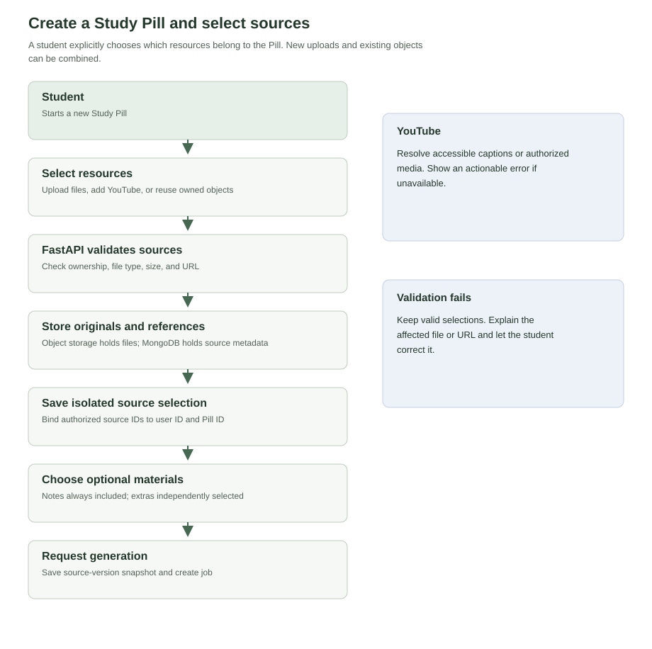
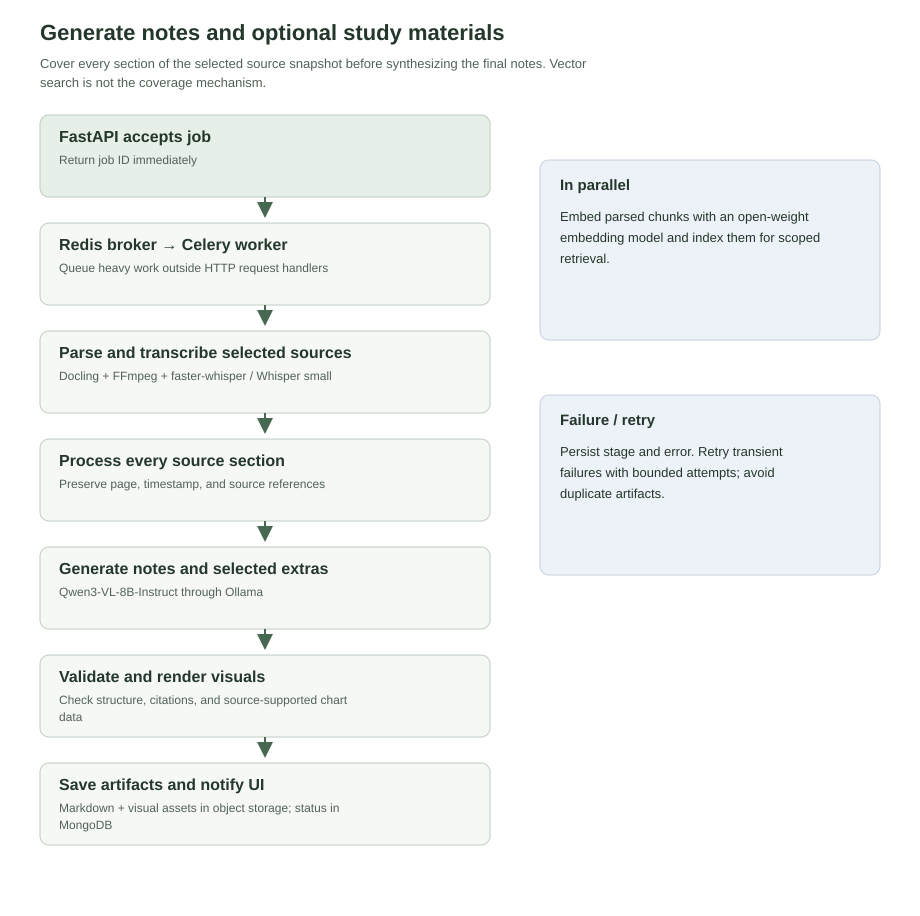
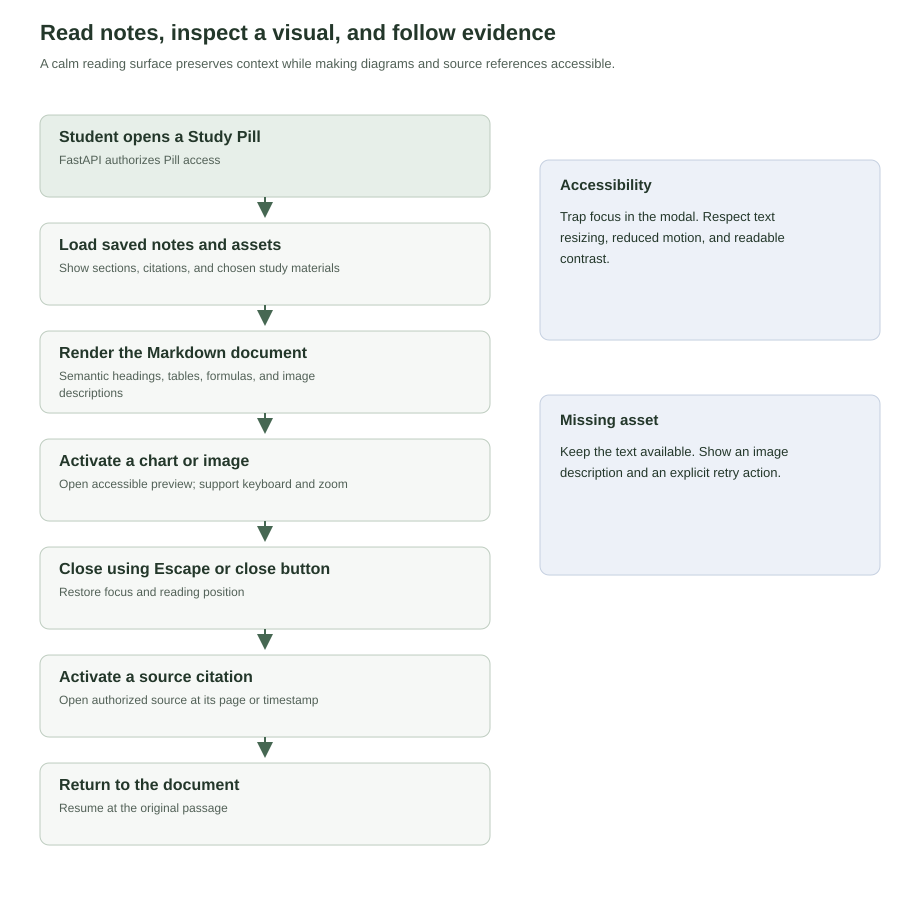
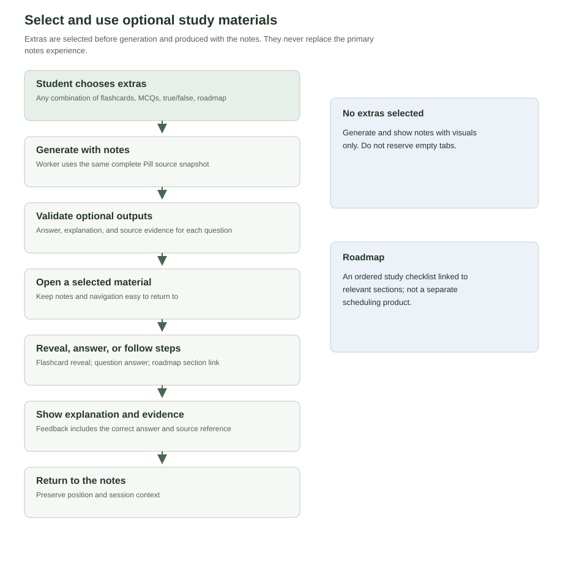
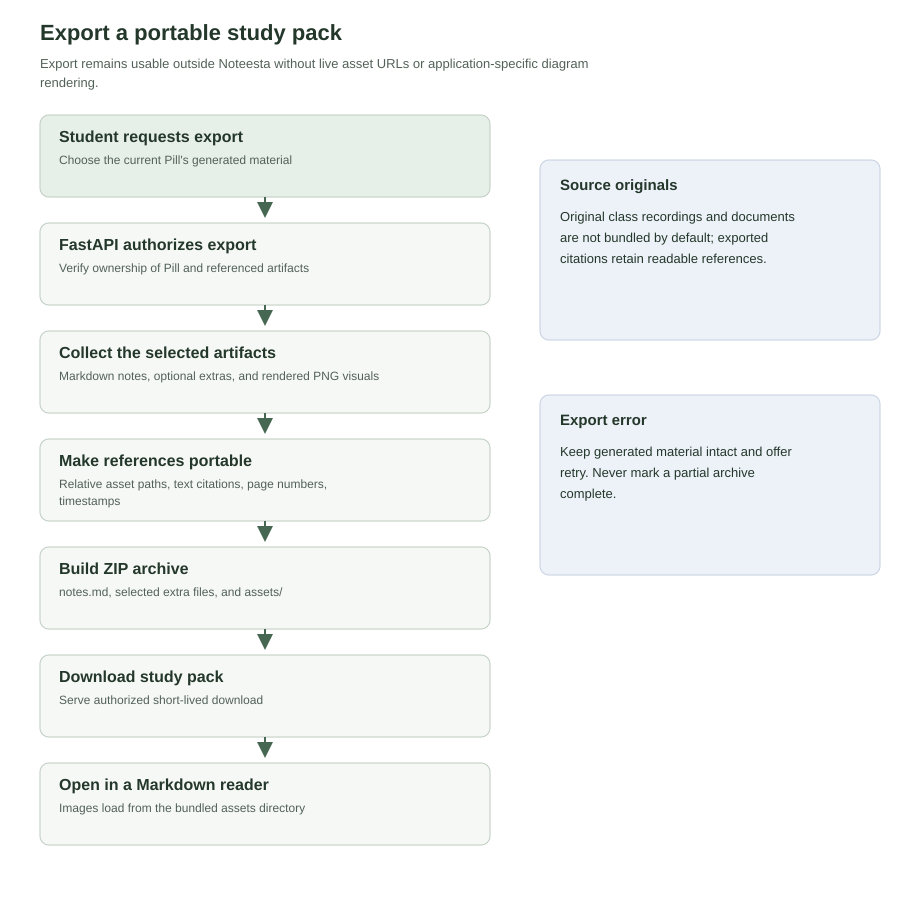
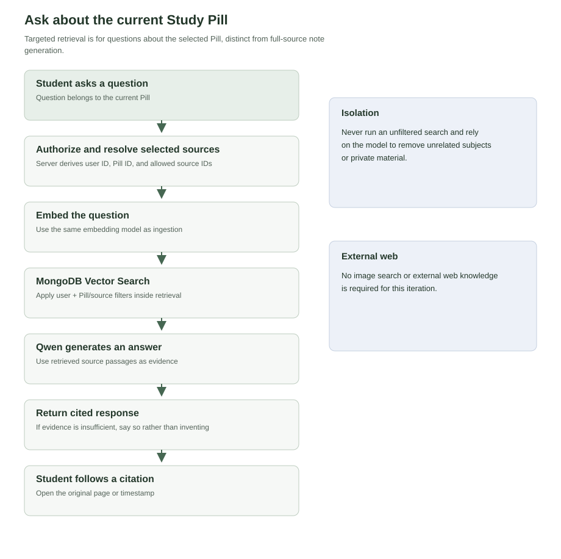

# Noteesta interaction diagrams

[Browse all rendered diagrams](diagrams.html) · [System architecture](system-architecture.md)

## 1. Create a Study Pill and select sources

A student explicitly chooses which resources belong to the Pill. New uploads and existing objects can be combined.

[Editable Mermaid source](diagrams/01-create-study-pill.mmd)

- **YouTube:** Resolve accessible captions or authorized media. Show an actionable error if unavailable.
- **Validation fails:** Keep valid selections. Explain the affected file or URL and let the student correct it.

## 2. Generate notes and optional study materials

Cover every section of the selected source snapshot before synthesizing the final notes. Vector search is not the coverage mechanism.

[Editable Mermaid source](diagrams/02-generate-materials.mmd)

- **In parallel:** Embed parsed chunks with an open-weight embedding model and index them for scoped retrieval.
- **Failure / retry:** Persist stage and error. Retry transient failures with bounded attempts; avoid duplicate artifacts.

## 3. Read notes, inspect a visual, and follow evidence

A calm reading surface preserves context while making diagrams and source references accessible.

[Editable Mermaid source](diagrams/03-read-and-preview.mmd)

- **Accessibility:** Trap focus in the modal. Respect text resizing, reduced motion, and readable contrast.
- **Missing asset:** Keep the text available. Show an image description and an explicit retry action.

## 4. Select and use optional study materials

Extras are selected before generation and produced with the notes. They never replace the primary notes experience.

[Editable Mermaid source](diagrams/04-optional-materials.mmd)

- **No extras selected:** Generate and show notes with visuals only. Do not reserve empty tabs.
- **Roadmap:** An ordered study checklist linked to relevant sections; not a separate scheduling product.

## 5. Export a portable study pack

Export remains usable outside Noteesta without live asset URLs or application-specific diagram rendering.

[Editable Mermaid source](diagrams/05-export-markdown.mmd)

- **Source originals:** Original class recordings and documents are not bundled by default; exported citations retain readable references.
- **Export error:** Keep generated material intact and offer retry. Never mark a partial archive complete.

## 6. Ask about the current Study Pill

Targeted retrieval is for questions about the selected Pill, distinct from full-source note generation.

[Editable Mermaid source](diagrams/06-grounded-chat.mmd)

- **Isolation:** Never run an unfiltered search and rely on the model to remove unrelated subjects or private material.
- **External web:** No image search or external web knowledge is required for this iteration.

